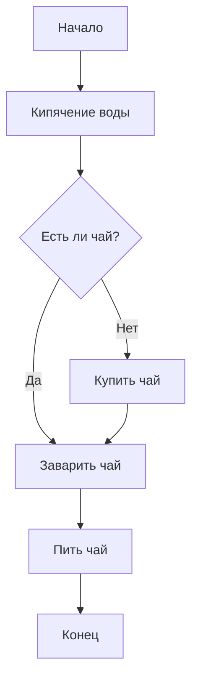
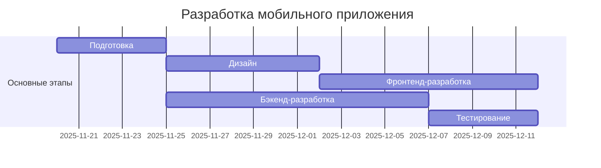
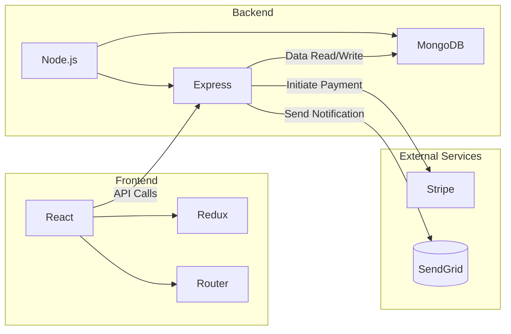
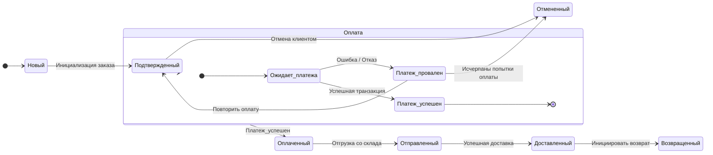
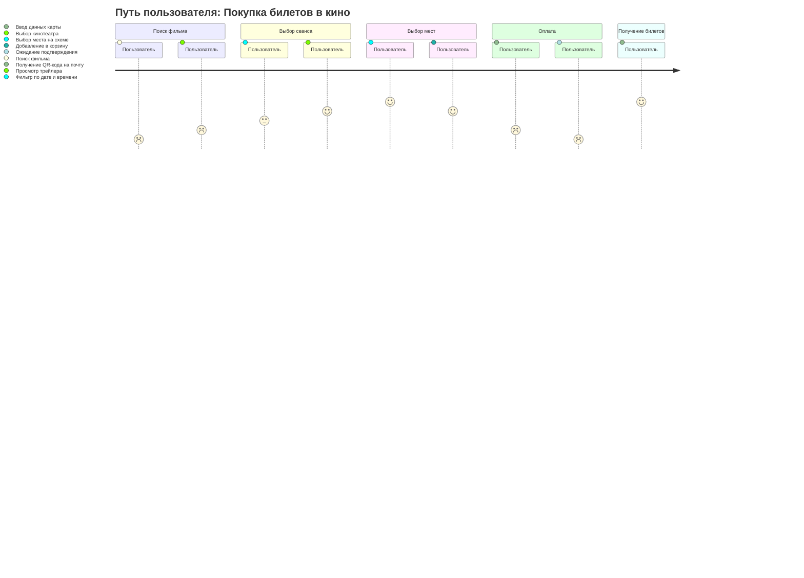
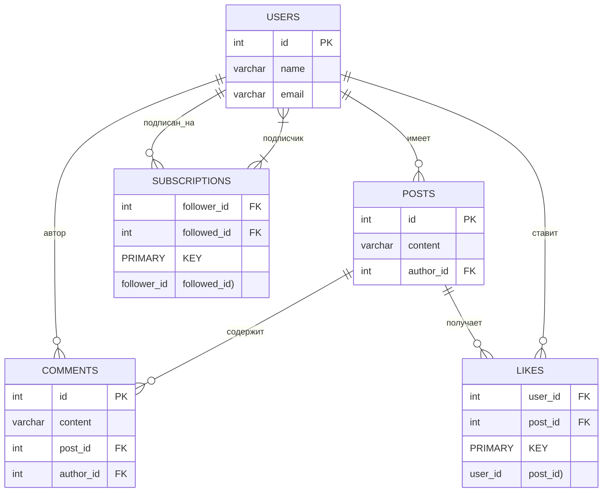

---
```mermaid
sequenceDiagram
    participant C as Клиент
    participant A as Приложение
    participant S as Сервер
    participant D as Водитель
    
    title Процесс заказа такси

    C->>A: Вызов такси через приложение
    activate A
    A->>S: Отправка запроса на поиск такси
    activate S
    S->>S: Поиск свободного водителя
    S->>D: Уведомление о новом заказе
    activate D
    D->>S: Принятие заказа
    S->>A: Подтверждение с данными водителя
    A->>C: Уведомление: "Водитель найден"
    deactivate A
    deactivate S
    D->>C: Забирает клиента
    deactivate D
 ```

---

```mermaid
classDiagram
    class Book {
        -String title
        -String author
        -String ISBN
        -Boolean isAvailable
        +borrow()
        +returnBook()
        +getInfo()
    }
    
    class User {
        -String name
        -String userId
        -List~Book~ borrowedBooks
        +borrowBook(book)
        +returnBook(book)
        +getBorrowedBooks()
    }
    
    class Library {
        -List~Book~ books
        -List~User~ users
        +addBook(book)
        +removeBook(book)
        +registerUser(user)
        +findBook(isbn)
        +lendBook(user, book)
    }
    
    User "1" *-- "*" Book : borrows
    Library "1" o-- "*" Book : contains
    Library "1" o-- "*" User : manages
```
---
---
# Диаграмма Ганта

---
# Продвинутый

---
#   Диаграмма состояний

---
# Экспертный

---
# ER-диаграмма базы данных
